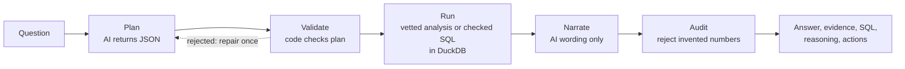

# BizLens

**A traceable AI decision engine that turns business data into answers, evidence, and actions.**

> BizLens doesn't just tell you what happened. It shows you the evidence behind the answer and what you can do next.

**Live demo:** https://bizlens-g2uh.onrender.com
*(free hosting: the first load after idle can take about a minute. Click **Use sample sales.csv** to start.)*


---

## Project overview

Dashboards show *what* changed but not *why*, and AI chatbots explain with confidence but can't prove their numbers. BizLens keeps the AI away from the math:

1. You upload a sales CSV or Excel file and ask a plain-English question, such as *"Why did revenue decrease last month?"*
2. The AI turns the question into a **structured plan** (JSON only). Code validates that plan.
3. **SQL on DuckDB does every calculation**, using one of five vetted analyses, or a validated custom query when none fits.
4. The AI writes the explanation, and an **audit rejects any number that isn't in the evidence**.

You get five things for each question: the **answer**, the **evidence** behind every number, the **exact SQL**, step-by-step **reasoning**, and prioritized **recommended actions**.

On the sample data it finds that revenue fell 20.5% (2026-08 to 2026-09), that the East region drives 78% of the drop, and that it is a volume effect (-229,777) rather than price (-969). When the data can't answer something, such as a forecast, it says so instead of guessing.

### Why you can trust the output
- **The AI never calculates.** Every figure comes from DuckDB. The AI never sees query results.
- **Vetted analyses first.** Five reconciled analyses; breakdowns must add up to the total or no result is returned.
- **Locked-down custom SQL.** One read-only `SELECT` over one table, parsed with DuckDB's own parser, run in a sandbox (no file access, locked config, one thread, time limit). It is always labelled as AI-written.
- **Audited narrative.** Every claim cites evidence IDs, and every number must appear in the evidence. Invented or derived numbers are rejected, with a plain fallback summary if the retry fails.
- **Reproducible.** Single-threaded engine, a dataset SHA-256, and the exact SQL on every result.
- **Private by design.** Only the schema and the top labels of each text column reach the LLM, never raw rows.

### Architecture



---

## Technologies used

| Layer | Technology |
|---|---|
| Backend / API | Python 3.12, Django, Django REST Framework |
| Analytics engine | DuckDB over Parquet (pandas, openpyxl for ingest) |
| AI | Groq API with `openai/gpt-oss-120b` behind a provider-agnostic interface, Pydantic structured outputs |
| Database | SQLite by default; Postgres when `POSTGRES_HOST` is set (used by `docker-compose.yml`) |
| UI | One self-contained HTML page served by Django (no build step) |
| Deploy | Docker, gunicorn, Render |

---

## Setup & installation

**Prerequisites:** Docker Desktop **or** Python 3.12, plus a free [Groq API key](https://console.groq.com).

```bash
git clone https://github.com/sayanMUXI07/bizLens.git
cd bizLens
cp .env.example .env        # Windows PowerShell: copy .env.example .env
```

Open `.env` and set `GROQ_API_KEY=<your key>`. Never commit this file.

Optional: set `GROQ_REASONING_EFFORT=low` for faster answers.

---

## How to run the project

### Option A: Docker (recommended)

```bash
docker compose up --build db backend
```

Wait for `Starting WSGI development server at http://0.0.0.0:8000/`, then open **http://localhost:8000/** in your browser.

Check the AI connection in a second terminal:

```bash
docker compose exec backend python manage.py llm_check     # should print OK
```

*(The `frontend/` folder is reserved for a future Next.js UI. The demo UI is served by Django, so start only `db backend`.)*

### Option B: Without Docker

```bash
cd backend
python -m venv .venv
.venv\Scripts\activate            # macOS/Linux: source .venv/bin/activate
pip install -r requirements.txt
export GROQ_API_KEY=your_key      # PowerShell: $env:GROQ_API_KEY="your_key"
python manage.py migrate
python manage.py runserver
```

With no `POSTGRES_HOST` set, the app uses SQLite automatically. Open **http://localhost:8000/**.

### Try the demo
1. Click **Use sample sales.csv** (or upload your own CSV/Excel with date, region, product, revenue, cost and similar columns).
2. Ask **"Why did revenue decrease last month?"** and click **Analyze**.
3. Click the evidence chips to jump to each number, open **Open SQL** to copy the query, and read the reasoning and recommended actions.
4. Other questions to try:
   - *Which products declined last month?* (vetted analysis)
   - *What is the average revenue per transaction by category?* (validated custom SQL)
   - *Forecast revenue for next year* (politely declined)

A timed 2½-minute walkthrough is in [DEMO.md](DEMO.md).

### API

```bash
# 1. upload a dataset
curl -F file=@backend/sample_data/sales.csv http://localhost:8000/api/datasets/

# 2. ask a question (use the "id" returned above)
curl -X POST http://localhost:8000/api/datasets/<id>/ask/ \
  -H "Content-Type: application/json" \
  -d '{"question": "Why did revenue decrease last month?"}'
```

The response contains the plan, the resolved parameters, the analysis result (measurements, tables, and every query with its rendered SQL), the audited narrative, and a step-by-step trace. `GET /api/health/` reports service and LLM status.

Terminal alternative: `python manage.py ask_question <dataset_id> "Why did revenue decrease last month?"`

### Tests

```bash
cd backend
python manage.py test      # 192 tests, no network or API key needed
```

---

## Project structure

```
bizLens/
├── backend/
│   ├── ai/          LLM provider (Groq, swappable), strict JSON schemas, prompts
│   ├── datasets/    upload, validation, Parquet storage, sandboxed DuckDB
│   ├── analytics/   five vetted, reconciled analyses + metric definitions
│   ├── ask/         question → plan → SQL guard → run → audited narrative
│   ├── core/        health check and the single-page demo UI
│   ├── config/      Django settings and URLs
│   └── sample_data/ sales.csv used by the demo
├── docs/            README screenshot
├── docker-compose.yml, render.yaml, DEPLOY.md, DEMO.md
```

## Deployment
One service on Render: see [DEPLOY.md](DEPLOY.md). `render.yaml` is a one-click blueprint; add `GROQ_API_KEY` in the dashboard.

## Known limitations
Single user and no login; datasets reset on restart on the free hosting tier; filters are equality-only; breakdowns show association in the data, not proven cause. The AI endpoint is rate-limited per IP (`ASK_RATE_LIMIT`, default 60/hour).
